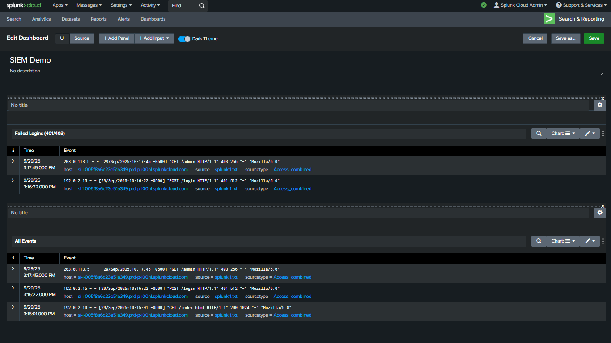

# Splunk SIEM Dashboard

## Overview
This project demonstrates a SIEM dashboard using Splunk with sample log data. It includes:
- **Failed Logins (401/403)** panel
- **All Events** panel

## Screenshots

## Learning Outcomes
- Hands-on experience creating dashboards in Splunk
- Understanding of filtering and visualizing security events
- Practical exposure to SOC tools and workflows

